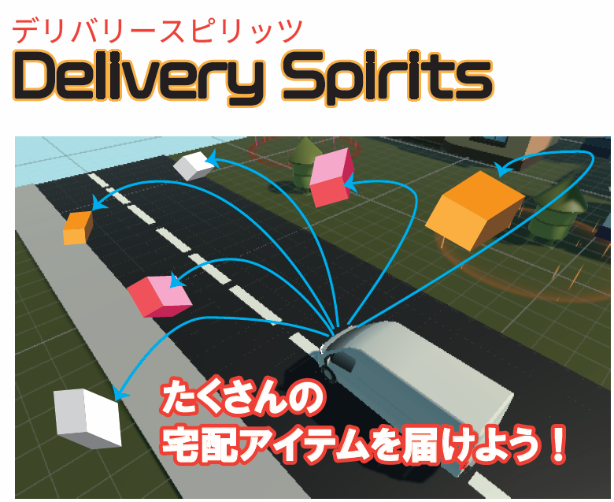
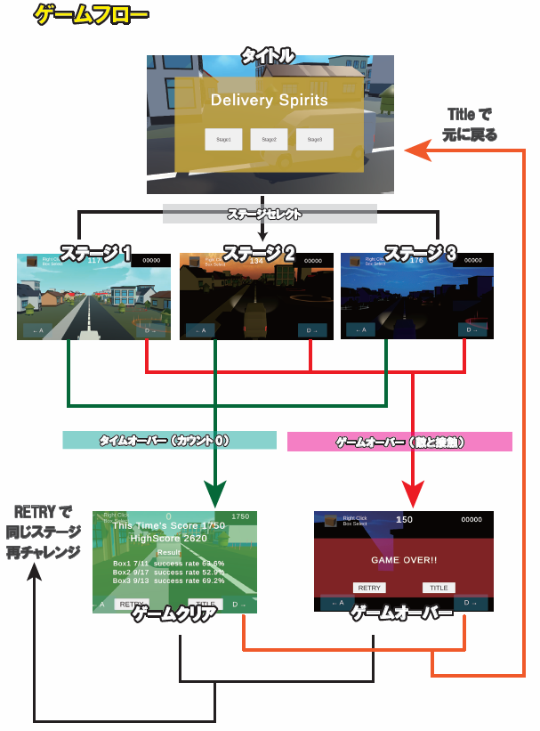
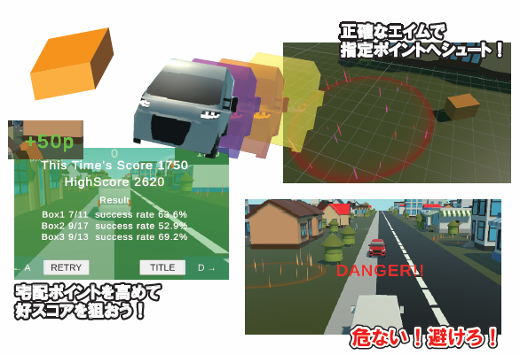
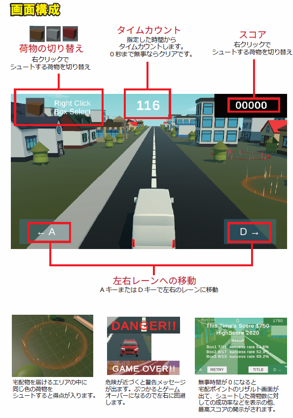
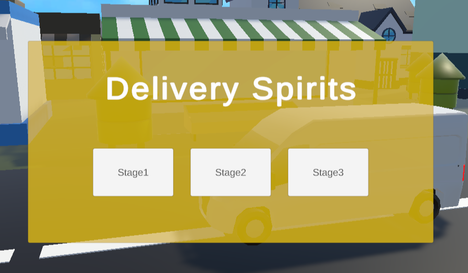
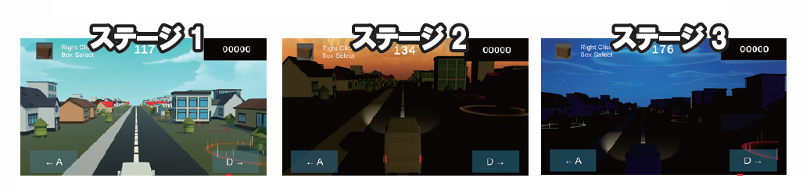
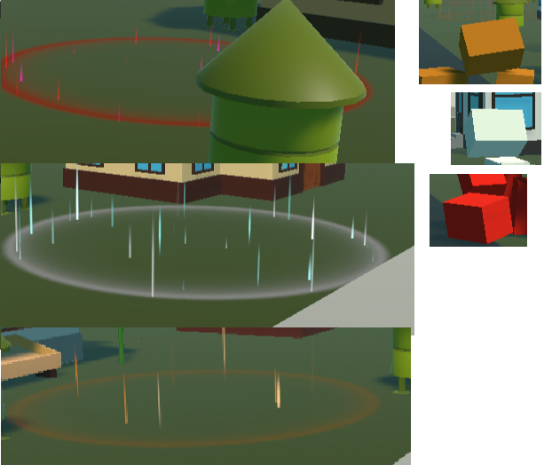
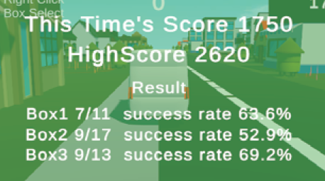

# Delivery Spirits


自動で前に進む配達版から指定された場所に荷物を届けるゲーム。
シンプルな操作でたくさんの荷物を的確に届けてたくさんポイントをGETしましょう！
油断していると接近してくる対向車とぶつかってゲームオーバーに。
安全運転を心がけてたくさんの荷物を住民に届けましょう！

##　使用したツールなど
* Unity(ver.2022.3.62f1)
* VisualStudio
* 利用したアセット
1. Low Poly city vehicle pack Lite
2. City Town LowPoly Pack
3. Area of Effect Spell FREE
4. Fantasy Skybox FREE

(Unityバージョンについて)
Unity6では古いアセットが使えないリスクがあったのと、CinemaShineの操作方法が大きく変更されているため、
開発効率を上げるために旧来の中でも当時一尾万斉信であったバージョンを採用しました。

(Skyboxの種類)
ゲームが重くなりすぎないように、比較的軽くて見た目がいいものをチョイスしました。
背景はステージごとに変えて秋を少なくするように工夫しています。

## 制作にあたって
Unityの3Dゲームの技術を高める練習として、総合的な内容にするべくゲームを考案しました。
* マウス操作と連動したカメラ支店
* カメラの角度を計算して宅配物が飛んでいく
* 宅配物を投函するときの細かな物理挙動
* エフェクトを利用したゴールエリアの設置
* ハイスコアを狙い何度も挑戦できるような仕組み
など、総合的な技術を盛り込みやすく、また、何回でもプレイできることで親しみやすくしています。
ひとつひとつはシンプルなつくりのため、効率的に開発を行うことができました。

## ゲーム企画




## 作品のポイント
### CinemaShineの活用

CinemaShineコンポーネントをタイトル時やステージクリア時に活用しています。

### SkyboxやLightineの調整

SkyboxとLightingの調整によって、ステージごとの雰囲気を変えています。

### 3つの宅配物と3つのゴールを用意

3種類用意した宅配物とゴールエリアの色を対応させ、

Shooter.cs抜粋
```C#
public GameObject[] boxPrefabs; //宅配物のプレハブを格納
//生成対象のBoxの切り替え
if (Input.GetMouseButtonDown(1))
{
    boxNum++;
    if (boxPrefabs.Length == boxNum) boxNum = 0;
}
```

Post.cs抜粋
```C#
private void OnTriggerEnter(Collider other)
{
    if (!posted)
    {
        switch (type)
        {
            case PostType.box1:
                if (other.gameObject.CompareTag("Box1"))
                    //宅配完了の処理
                    PostComp();
                    break;
            case PostType.box2:
                if (other.gameObject.CompareTag("Box2"))
                    //宅配完了の処理
                    PostComp();
                    break;
            case PostType.box3:
                if (other.gameObject.CompareTag("Box3"))
                    //宅配完了の処理
                    PostComp();
                    break;
        }                        
    }
}
```


### 宅配成功率の計算

投函した荷物の成功数を色別にカウントしておき、全体スコアそのものだけではなく、
細かいやりこみもできるようにしています。

```C#
//3つのBoxの成功率を表示
                for(int i =0; i < resultNames.Length; i++)
                {
                    float successRate;
                    if (Shooter.shootCounts[i] == 0) successRate = 0;
                    else
                    {
                        //Boxの計算 ※少なくとも片方はfloatにキャスト
                        successRate = ((float)Post.successCounts[i] / Shooter.shootCounts[i]) * 100f;
                    }
                    boxText[i].text = resultNames[i] + " " + Post.successCounts[i] + "/" + Shooter.shootCounts[i] + "  success rate " + successRate.ToString("F1") + "%";
                }
                GameController.gameState = GameState.timeover;
                //リザルトパネルの表示
                resultPanel.SetActive(true);
                //カーソルロックモードの解除
                Cursor.lockState = CursorLockMode.None;
                Cursor.visible = true;

```


## 今後の制作
* 着地の仕方によって破損率を出す
* 走るスピードを自分でコントロール
* NPCの配置


など、反映できなかったギミックは次回へ活かしていきたいと思います。